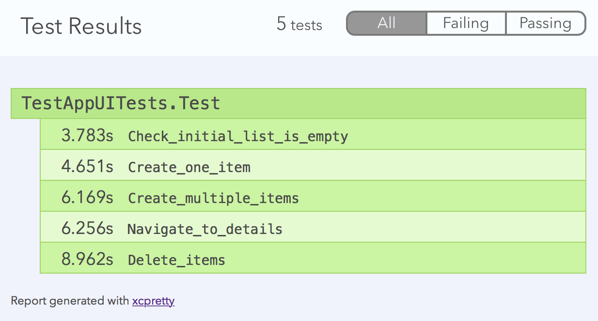

Behaviour-driven testing framework on top of the Xcode UI Tests that allows to define acceptance tests using a natural language that all team members understand.

**Given** you have a lot of test cases created with [JBehave](http://www.jbehave.org)  
**When** you want to use these test cases with Xcode UI Tests  
**Then** you should give _swift-behave_ a try  

## Usage

For now, *swift-behave* is used by simply dropping the following files into your UITests folder. 

    Scneario.h
    Scenario.m
    ScenarioTestCase.h
    ScenarioTestCase.m
    SwiftBehaveTest.swift

Since some of the code is written in Objective-C Xcode will ask you to create a bridgning header within the UITest target. Add the header files to the bridging header as follows.

```objc
#import "Scenario.h"
#import "ScenarioTestCase.h"
```

Next steps (work in progress, to be detailed):
* Write a Swift extension of SwiftBehaveTest containing your implementations for the behaviour-driven text blocks.
* Write a `.story` file containing your test in given/when/then syntax.
* Create a Swift class extending SwiftBehaveTest and name it like your `.story` file. You should have a pair of test classes, e.g. `MyTest.story`and `MyTest.swift`. 
* In `MyTest.swift` override the static method `storyfile` to return the plain name of your test. I'm currently looking into this to get rid of this step.
* Run the tests within Xcode with `command U` or from the commandline using `xcodebuild test`.

## Example

Check out the example app that is included in this repository. The app is basically the master-detail-template provided by Apple. Find the ´Test.story´ file to see, how tests are specified using a natural and readable language.

```
Scenario: Check initial list is empty
Given the main view is shown
Then I expect to see 0 items

Scenario: Create one item
Given the main view is shown
When I tap the add button
Then I expect to see 1 items
...
```

I recommend using [xcpretty](https://github.com/supermarin/xcpretty) if you want to see the test results outside of Xcode. Run the test from the command line with the following command.

```bash
xcodebuild -scheme TestApp -destination 'platform=iOS Simulator,name=iPhone 5s,OS=9.3' test | xcpretty -r html
```

This will build the app and test target, execute the tests and produce the following test report. Note, that the scenario names are used as the test case names in the test report.



## Roadmap

### Done
* "Playback" plain text files that define test cases in the Given/When/Then form.
* Create a simple test app to demonstrate how *swift-behave* works
* Gather test execution information and present results
* Create an eye-catchy banner thing for this project.

### TODO
* Add a launch hook to allow adding launch arguments or to specify the initial device orientation.
* Integrate test step execution logging with the overall test log to see which step of a test caused it to fail.
* Get rid of static override in SwiftBehaveTest subclasses.
* Find an alternative way of distributing *swift-behave* than the current file drop-in.
* Create documentation of the steps neccessary to get started with *swift-behave*.
* Build some level of IDE integration with Xcode
